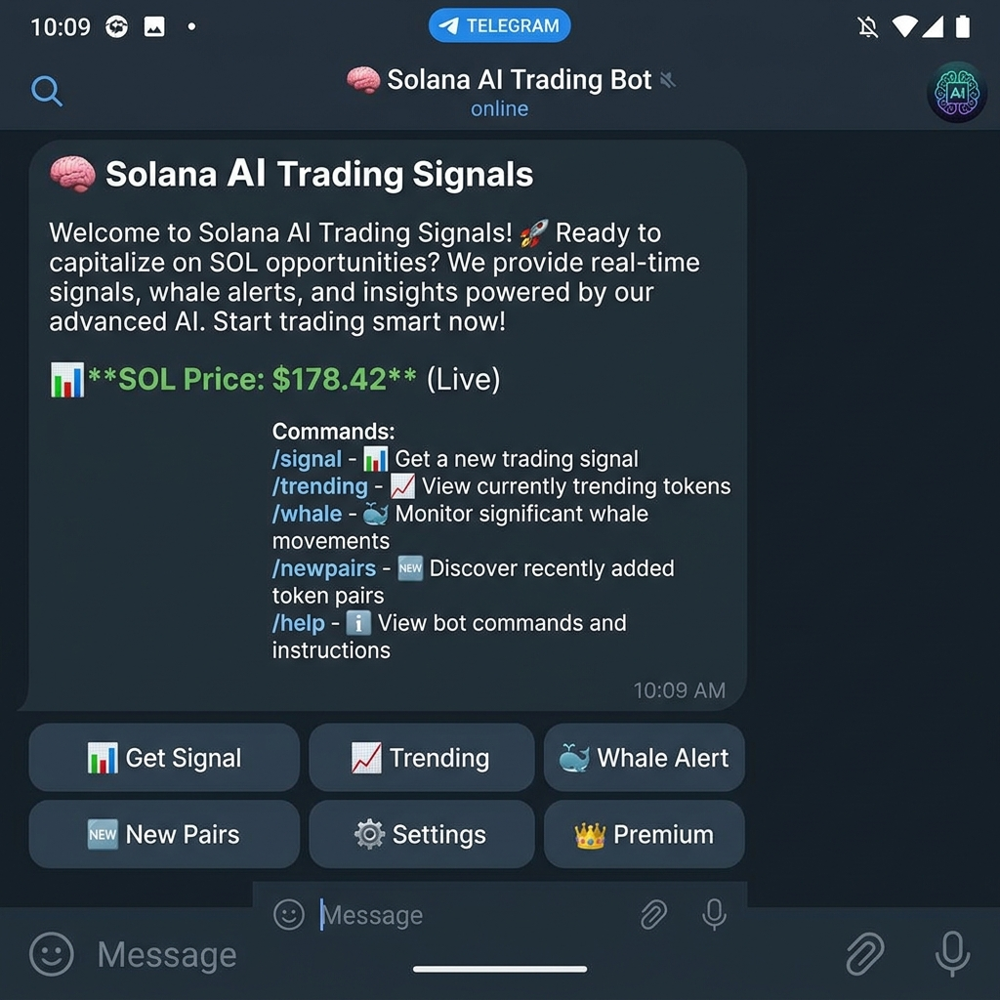
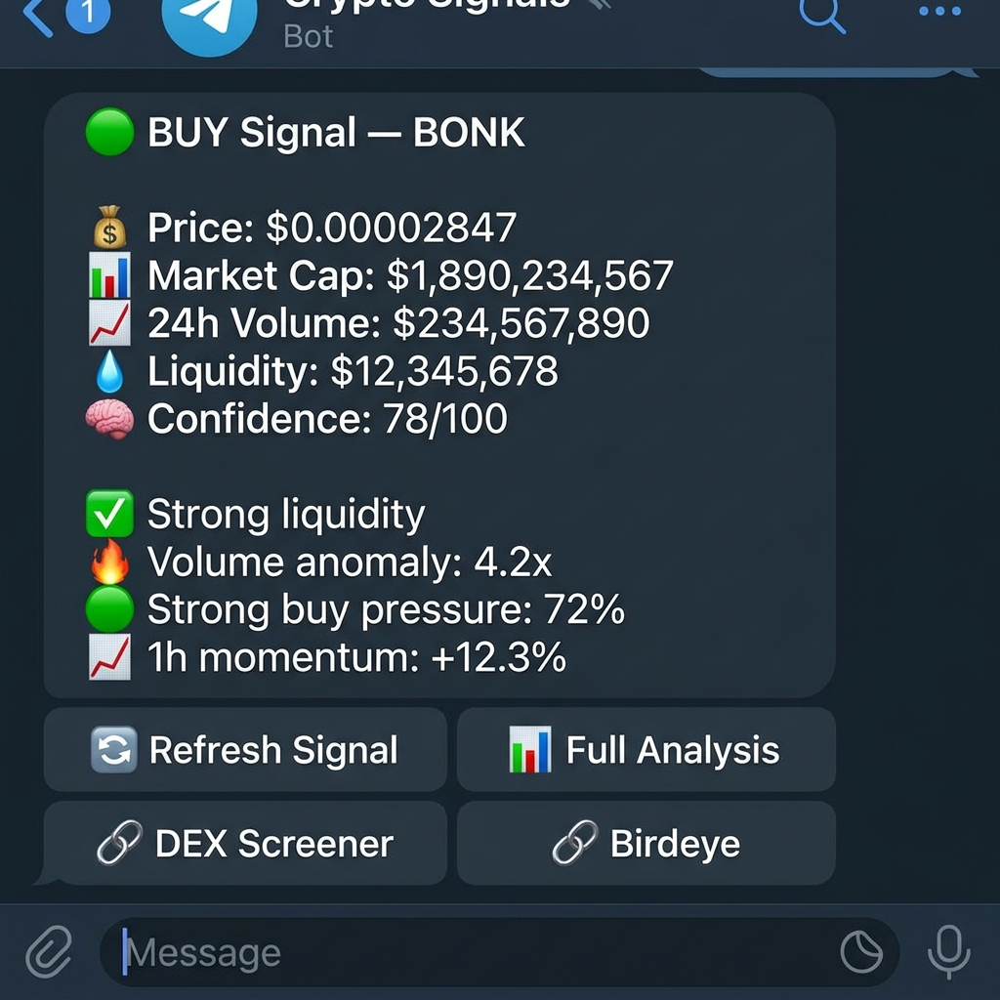
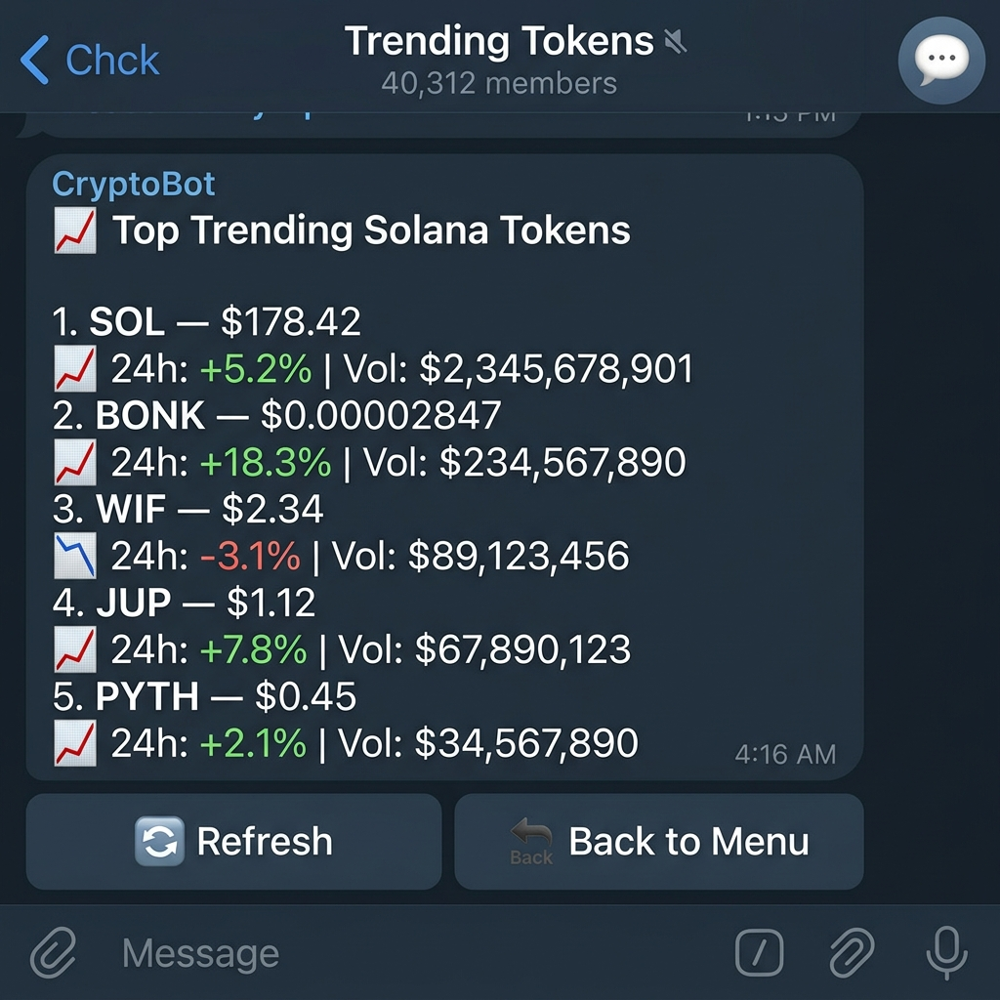

# 🧠 Solana AI Trading Bot

Next-generation AI-powered Solana trading infrastructure for sniping, automation, smart wallet tracking and advanced DeFi execution.

[](https://python.org)
[](LICENSE)
[](https://solana.com)

### 🚀 Build Your Own Advanced AI-Powered Telegram Trading Bot in Minutes

> **Stop guessing. Start trading with machine intelligence.**
>
> This isn't just another signal bot — it's a **full-stack AI trading engine** that reads the Solana blockchain in real-time, runs every token through a 12-feature neural network, and delivers institutional-grade signals directly to your Telegram. Clone it, configure it, own it.

---

## 💡 Why This Project?

Ever wanted to build a **professional crypto trading bot** but didn't know where to start? This project gives you **everything you need** — a complete, production-ready codebase that you can deploy in under 5 minutes.

🔥 **What makes this different:**
- **Real AI, not fake signals** — A trained neural network scores tokens across 12 on-chain and market features
- **Live blockchain data** — Pulls directly from Solana mainnet via Helius RPC, not cached or delayed APIs
- **Whale intelligence** — Know what the big money is doing before the crowd catches on
- **Zero infrastructure** — No Docker, no databases to manage, no cloud services. Just `pip install` and go
- **Fully customisable** — Train your own model, tweak scoring thresholds, add new strategies
- **Production battle-tested** — Rate limiting, graceful shutdown, structured logging, health checks

Whether you're a **trader** looking for an edge, a **developer** building your portfolio, or an **entrepreneur** launching a signal service — this is your starting point.

---

## 📸 See It in Action

<p align="center">
  
  &nbsp;&nbsp;
  
  &nbsp;&nbsp;
  
</p>

<p align="center">
  <sub><b>Left:</b> Welcome screen with live SOL price &nbsp;|&nbsp; <b>Center:</b> AI signal with confidence breakdown &nbsp;|&nbsp; <b>Right:</b> Trending tokens ranked by volume</sub>
</p>

---

## ✨ Features at a Glance

| Feature | Description |
|---------|-------------|
| 🧠 **AI-Powered Signals** | ML-driven BUY/SELL/HOLD with confidence scores (0–100) |
| 📊 **Real-time Market Data** | Live price, volume, and liquidity from DEX Screener + CoinGecko |
| 🐋 **Whale Tracking** | Monitor large wallet movements on Solana (≥500 SOL) |
| 🆕 **New Pair Detection** | Spot newly created liquidity pools before everyone else |
| 📈 **Trending Dashboard** | Top trending Solana tokens ranked by 24h volume |
| 🔗 **5 API Integrations** | Helius RPC, DEX Screener, Jupiter, Birdeye, CoinGecko |
| 💎 **Premium System** | Built-in subscription tiers ready for monetisation |
| ⚡ **Zero External Services** | No Docker, no Redis, no cloud — pure Python |
| 🛡️ **Production-Ready** | Rate limiting, health checks, structured logging, graceful shutdown |
| 🎯 **Train Your Own Model** | Backtest & train custom models with included scripts |

---

## 🚀 Get Started in 60 Seconds

### Prerequisites

- **Python 3.11+** (that's it — no other system dependencies)
- A Telegram Bot Token from [@BotFather](https://t.me/BotFather) *(free)*
- A Helius RPC API key from [helius.dev](https://helius.dev) *(free tier available)*

### Launch Your Bot

```bash
git clone https://github.com/AiSolanaAgentCoder/solana-ai-trading-bot.git
cd solana-ai-trading-bot
pip install -r requirements.txt
cp .env.example .env   # ← Add your API keys here
python -m bot.main
```

**That's it.** Your AI trading bot is now live on Telegram. No servers to manage, no containers to build, no databases to configure. Just pure Python power.

---

## 📱 Bot Commands

| Command | Description |
|---------|-------------|
| `/start` | Welcome message with live SOL price and bot capabilities |
| `/signal <address>` | Get AI trading signal for any Solana token |
| `/trending` | Top 10 trending tokens with 24h metrics |
| `/whale` | Recent whale movements (≥500 SOL transactions) |
| `/newpairs` | Newly created liquidity pools with analysis |
| `/settings` | Toggle notification preferences |
| `/premium` | Premium subscription info |

---

## 🏗️ Architecture

```
┌──────────────┐     ┌──────────────┐     ┌──────────────┐
│   Telegram   │────▶│   Bot Core   │────▶│  AI Engine   │
│    Users     │◀────│  (Handlers)  │◀────│  (Predictor) │
└──────────────┘     └──────┬───────┘     └──────┬───────┘
                            │                     │
                     ┌──────▼───────┐     ┌──────▼───────┐
                     │  Blockchain  │     │   Feature    │
                     │  (Solana RPC)│     │  Engineering │
                     └──────┬───────┘     └──────────────┘
                            │
                     ┌──────▼───────┐     ┌──────────────┐
                     │  DEX Screener│     │  In-Memory   │
                     │  Jupiter API │     │    Cache     │
                     │  Birdeye API │     │  + SQLite DB │
                     └──────────────┘     └──────────────┘
```

---

## 🧠 AI Prediction Engine

The brain of the bot — a **12-feature neural network** that analyses every token across multiple dimensions to generate a single, actionable signal.

| # | Feature | Source | What It Measures |
|---|---------|--------|------------------|
| 1 | Volume Anomaly | DEX Screener | Unusual trading activity spikes |
| 2 | Liquidity Depth | DEX Screener | How much liquidity backs the token |
| 3 | Holder Concentration | Solana RPC | Rug-pull risk from top wallets |
| 4 | Buy/Sell Ratio | DEX Screener | Market sentiment direction |
| 5 | Price Momentum (1h) | DEX Screener | Short-term trend strength |
| 6 | Price Momentum (24h) | DEX Screener | Medium-term trend strength |
| 7 | Market Cap (log) | DEX Screener | Token size classification |
| 8 | Token Age | On-chain | How established the token is |
| 9 | FDV/MCap Ratio | DEX Screener | Unlock risk assessment |
| 10 | Transaction Count | DEX Screener | Overall activity level |
| 11 | Volume/Liquidity | Calculated | Trading intensity metric |
| 12 | Price Volatility | Calculated | Recent price fluctuation |

### How Signals Work

| Signal | Condition | Meaning |
|--------|-----------|---------|
| 🟢 **BUY** | Score ≥ 70/100 | Strong bullish indicators across multiple features |
| 🟡 **HOLD** | Score 31–69/100 | Mixed signals — wait for clearer direction |
| 🔴 **SELL** | Score ≤ 30/100 | Bearish pressure detected — consider exiting |

> 💡 **Always-on guarantee:** If the ML model CDN is unreachable, the bot automatically falls back to heuristic scoring. It never goes offline.

---

## 🎯 Train Your Own Model

Don't just use our model — **build your own** with the included training pipeline:

```bash
# Generate synthetic training data and train a custom model
python scripts/train.py --samples 10000 --epochs 200

# Backtest your model against live market data
python scripts/backtest.py --tokens SOL BONK WIF JUP
```

Tweak the feature weights, adjust thresholds in `config/constants.py`, and create a signal engine that matches **your** trading style.

---

## 🔧 Configuration

All configuration via environment variables — see [`.env.example`](.env.example):

| Variable | Required | Description |
|----------|----------|-------------|
| `TELEGRAM_BOT_TOKEN` | ✅ | Bot API token from @BotFather |
| `HELIUS_RPC_URL` | ✅ | Solana RPC endpoint |
| `MODEL_CDN_URL` | ❌ | AI model download URL |
| `BIRDEYE_API_KEY` | ❌ | Enhanced token metadata |
| `SENTRY_DSN` | ❌ | Error tracking (optional) |

---

## 🧪 Testing

```bash
# Run all tests
pytest tests/ -v

# With coverage report
pytest tests/ --cov=. --cov-report=html
```

---

## 📁 Project Structure

```
solana-ai-trading-bot/
├── bot/                    # Telegram bot
│   ├── main.py            # Entry point with graceful shutdown
│   ├── handlers.py        # All 7 command handlers
│   ├── keyboards.py       # Inline keyboard builders
│   └── rate_limiter.py    # Anti-spam (10 req/user/min)
├── ai/                     # AI engine
│   ├── predictor.py       # ML prediction orchestrator
│   ├── model_loader.py    # CDN download + SHA256 verify
│   ├── feature_engineer.py # 12-feature extraction
│   └── token_scorer.py    # Heuristic fallback scorer
├── blockchain/             # Chain integration
│   ├── solana_rpc.py      # Async RPC with retry
│   ├── dex_screener.py    # DEX price & volume data
│   ├── whale_tracker.py   # Large tx monitoring
│   └── token_metadata.py  # Birdeye + CoinGecko + Jupiter
├── data/                   # Local storage
│   ├── cache_manager.py   # In-memory TTL cache
│   └── migrations.py      # SQLite schema management
├── config/                 # Configuration
│   ├── settings.py        # Pydantic env-based settings
│   └── constants.py       # Token addresses & thresholds
├── scripts/                # Utilities
│   ├── backtest.py        # Signal backtester
│   └── train.py           # Model trainer
├── tests/                  # Test suite
├── assets/screenshots/     # Bot screenshots
├── requirements.txt
├── .env.example
└── README.md
```

---

## 💬 What Can You Build With This?

- 🤖 **Your own signal service** — Add a payment gateway and monetise your signals
- 📡 **A copy-trading bot** — Extend with Jupiter swap execution for auto-trading
- 📊 **A research dashboard** — Pipe signals into a web UI or Discord
- 🏦 **A fund management tool** — Track portfolios and generate daily reports
- 🎓 **A learning project** — Understand how real trading bots work from the inside out

The architecture is modular by design. Swap out the AI engine, add new data sources, integrate new chains — **the possibilities are endless.**

---

## 🤝 Contributing

We welcome contributions! See [CONTRIBUTING.md](CONTRIBUTING.md) for code style and PR guidelines.

## 📝 License

MIT License — see [LICENSE](LICENSE). Use it, modify it, ship it.

---

<p align="center">
  <b>⭐ If this project helped you, give it a star — it means a lot!</b>
</p>

---

> **⚠️ Disclaimer:** This bot is for educational and research purposes only. It does not constitute financial advice. Cryptocurrency trading involves significant risk of loss. Always do your own research (DYOR) before making any investment decisions.
